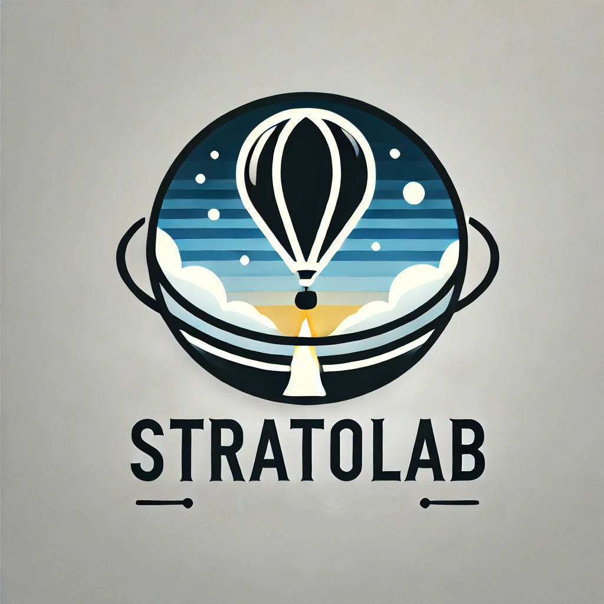

Welcome to StratoLab! StratoLab is a project built to be usable by schools, community groups, youth organizations, and more as an introduction to programming, electronics and team building.

The [National Weather Service](https://www.weather.gov/chs/upperair) launches a minimum of two high altitude balloons a day from [91 locations](https://www.weather.gov/upperair/nws_upper) at `1100` and `2300` UTC to observe weather conditions used to model weather forecasts. When flying high altitude balloons, data is usually collected throughout the flight and later retrieved for analysis.

This project contains lessons wherein learners will launch their own weather balloon to the stratosphere, or approximately 90,000+ feet. Throughout the balloon flight, the components within the payload will collect temperature, barometric pressure, latitude, longitude, elevation, and other telemetry data. This information is collected via the peripheral modules attached to the microcontrollers within the payload and stored in an SD card for analysis after recovery.

The project contains basic hands-on experiences with the following:

Microcontrollers & electronics, including wiring peripheral modules between a microcontroller and breadboard
Programming microcontrollers to interact with peripheral modules using C programming language (Arduino microcontroller) or Python (Raspberry Pi Pico microcontroller)
Launching a finished product in a high-altitude balloon flight to the stratosphere (90,000+ feet)
Analyzing collected data after recovering the balloon payload
Each lesson is constructed to be completed within the timeframe of a typical classroom experience (approximately 45 minutes to 1 hour), and are designed to be completed by small groups (between 2 and 5 learners is recommended)

Let's get started!

# Balloon

* Overview: [What to know before launching a high altitude balloon](balloon/overview.md)
* Supplies: [Materials need to assemble the balloon and its payload](balloon/supplies.md)
* Assembly: [Assembly instructions and day-of-launch guidance](balloon/assembly.md)
* Prediction: [Tools and techniques for predicting balloon flight behavior](balloon/prediction.md)

# Radio

TODO

# Tracker

TODO

# Telemetry

Telemetry is a series of lessons with instructions for wiring hardware modules to a microcontroller, then programming the microcontroller to interface with the modules. Throughout these lessons, individuals will learn the basiscs of microcontrollers, wiring, programming, and debugging.

## Hardware

* [Raspberry Pi Pico](/telemetry/raspberry-pi-pico/hardware/README.md)
  * [Workbench](/telemetry/raspberry-pi-pico/workbench/README.md)
  * [Lesson 1](/telemetry/raspberry-pi-pico/python/lesson-1/README.md)
  * [Lesson 2](/telemetry/raspberry-pi-pico/python/lesson-2/README.md)
  * [Lesson 3](/telemetry/raspberry-pi-pico/python/lesson-3/README.md)
  * [Lesson 4](/telemetry/raspberry-pi-pico/python/lesson-4/README.md)
  * [Lesson 5](/telemetry/raspberry-pi-pico/python/lesson-5/README.md)
  * [Lesson 6](/telemetry/raspberry-pi-pico/python/lesson-6/README.md)
  * [Lesson 7](/telemetry/raspberry-pi-pico/python/lesson-7/README.md)
  * [Lesson 8](/telemetry/raspberry-pi-pico/python/lesson-8/README.md)
* Arduino
  * [Workbench](/telemetry/arduino/workbench/README.md)
  * [Lesson 1](/telemetry/arduino/c/lesson-1/README.md)
  * [Lesson 2](/telemetry/arduino/c/lesson-2/README.md)
  * [Lesson 3](/telemetry/arduino/c/lesson-3/README.md)
  * [Lesson 4](/telemetry/arduino/c/lesson-4/README.md)
  * [Lesson 5](/telemetry/arduino/c/lesson-5/README.md)
  * [Lesson 6](/telemetry/arduino/c/lesson-6/README.md)
  * [Lesson 7](/telemetry/arduino/c/lesson-7/README.md)

# Data

TODO

    
This project and the projects within adheres to the GPLv3 license. "IN NO EVENT UNLESS REQUIRED BY APPLICABLE LAW OR AGREED TO IN WRITING WILL ANY COPYRIGHT HOLDER, OR ANY OTHER PARTY WHO MODIFIES AND/OR CONVEYS THE PROGRAM AS PERMITTED ABOVE, BE LIABLE TO YOU FOR DAMAGES, INCLUDING ANY GENERAL, SPECIAL, INCIDENTAL, OR CONSEQUENTIAL DAMAGES ARISING OUT OF THE USE OR INABILITY TO USE THE PROGRAM."
    

    
For more information reference the full <a href="https://www.gnu.org/licenses/gpl-3.0.en.html">GPLv3 license</a>.
