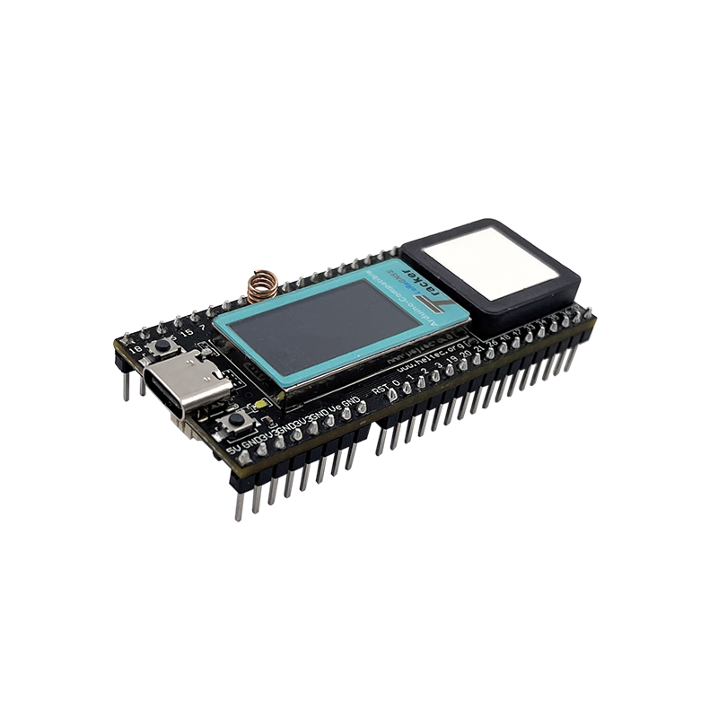
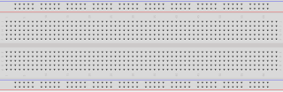
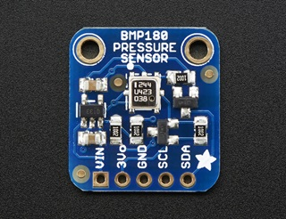
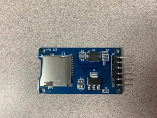
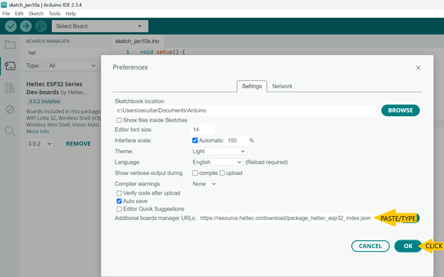
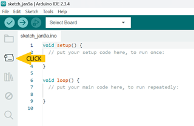
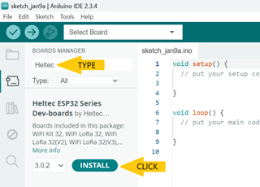
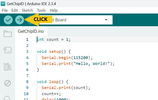

# Lesson 1: Introduction and how to get started building the StratoLab

### Objectives:
Students will: 
- learn the components used for this project
- gain a basic understanding of electronics to complete the project
- ensure they can connect to the microcontroller and upload code

### Materials:
- [Heltec Wireless Tracker](https://heltec.org/project/wireless-tracker/)\
  
- [Breadboard](https://learn.sparkfun.com/tutorials/how-to-use-a-breadboard/all)\
 
- [BMP-180 - Barometric Pressure/Temperature/Altitude Sensor](https://www.adafruit.com/product/1603)\
  
- [SD card adapter](https://electropeak.com/micro-sd-tf-card-adapter-module)\
   
- [Micro SD card](https://en.wikipedia.org/wiki/SD_card)\
   

### What do all these parts do anyway?

#### [Microcontroller](https://en.wikipedia.org/wiki/Microcontroller)
  - Made up of [integrated circuits](https://en.wikipedia.org/wiki/Integrated_circuit)
  - Interprets data from inputs and takes action via outputs. Some examples you may have encountered are:
    - Detect if a door is open then sound an alarm
    - Determine if it's dark, then turn on a light
    - Sense its hot and turn on a fan
  - Multiple actions can be taken with complex decisions software determines. An example:
    - Thermostat:
      - If its nighttime keep temperatures cooler
        - Determine if its night
          - Reduce temperature
            - If its hot turn on the air conditioning
            - If its cold use less heat
    - Burglar alarm:
      - Determine if the alarm is set
        - If a window is broken sound an alarm
          - Dispatch a security company to look for intruder
    - What are some other things you encounter that may be based on microcontrollers?
    
#### [Breadboard](https://en.wikipedia.org/wiki/Breadboard)
- Fun Fact, the name breadboard came from the origin of the device. Amateur Radio operators used cutting boards (sometimes used for cutting bread) to build circuits for testing their designs
- A breadboard is a piece of plastic with conductive material layered in channels in order to prototype circuits without having to solder anything
    - There are three main parts to a bread board, the power rails, the terminal strips, and the DIP support channel.
    - The DIP support channel is the channel that runs through the middle of the board. It splits the terminal strips into two and makes it so many different integrated circuits can be used while taking up minimum space on the breadboard. Each pin of the IC (integrated circuit) is unique and needs to be separate from the other pins, hence the need for a channel that breaks up the terminal strips. 
    - Terminal strips are the strips of metal that connect the rows of pins, they are hidden, but important. This means that all of the holes on either side of the DIP channel are connected to each other. 
    - The power rails are typically accompanied by a blue or red line. These are used to provide a power source and a common ground. Blue means negative or ground and red means positive or power.
           
    - The red and blue arrows are pointing to the positive and negative power rails respectively. The yellow arrow is illustrating which pin are connected. The pins are connected in the same direction as the yellow arrow, but separated by the channel in the middle. They are connected horizontally and not vertically in this picture. 
    - If you want more information on breadboards please refer to <a href=https://learn.sparkfun.com/tutorials/how-to-use-a-breadboard/all title="How to Use a Breadboard">This article</a>
- IT's VERY important to keep in mind polarity:
  - Electronics only work one way, if you connect the positive wire to the negative terminal, and the negative wire to the positive terminal, you may ruin the component you are working with. We don't want to release the [magic smoke](https://en.m.wikipedia.org/wiki/Magic_smoke)!!

#### [LED](https://en.wikipedia.org/wiki/Light-emitting_diode)
- LED stands for Light Emitting Diode
- LED's are semiconductors that light when current flows through them
- LED's have polarity which means the way power is appliec should be done only one way! On the bottom of the LED's in the kit, you will notice the leads are different lengths
  - Anode (longer) is positive 
  - Cathode (shorter) is negative
- Where do you have LED's around you throughout your day?

#### [Resistors](https://en.wikipedia.org/wiki/Resistor)
- Resistors are used to reduce current in a circuit
- Resistors will be used with LED's in Lesson 2
  - For the work we are doing you an experiment with different resistors and see what they do with the brightness of your LED's in Lesson 2
- Resistors used in this project look like a piece of wire with a ceramic body on them shaped like a barrel
  - There are many different kinds of resistors in the wild and they can look very different or even be embedded in circuit boards and chips.
- Resistors have a series of bands that identify how much resistance they have
  - Resistance is measured in OHM's. The value is noted by the colors and orders of the bands on the side of the resistor. have a look at the ones in the kit
  - [Ohm's law](https://en.wikipedia.org/wiki/Ohm%27s_law) can be used to calculate your needs based on different situations

#### [BMP-180](https://www.adafruit.com/product/1603)
- This small sensor allows us to measure the temperature and barometric pressure
- This device uses something called [I2C](https://en.wikipedia.org/wiki/I%C2%B2C which allows many devices to be connected to the same pins on the microcontrolles but have unique address's to identify each component
  - This allows sensors like the BMP-180 to provide readings to be taken by multiple devices but only using two pins on the microcontroller. 
    - A use for this would be to have multiple BMP-180 sensors reading the temperature inside the payload and another measuring outside or even on various things in the payload

#### [GPS Module](https://www.u-blox.com/en/product/neo-6-series)
- This device is the actual component (components actually) to allow us to track [latitude](https://en.wikipedia.org/wiki/Latitude), [longitude](https://en.wikipedia.org/wiki/Longitude), [altitude](https://en.wikipedia.org/wiki/Altitude), time in [UTC](https://en.wikipedia.org/wiki/Coordinated_Universal_Time), and track how many satellites signals received to determine accuracy as well as its just plain cool to know!
- GPS stands for [Global Positioning System](https://en.wikipedia.org/wiki/Global_Positioning_System) which in short triangulates the devices position based on details from multiple satellites (4 or more, the more satellites in the calculation the more accurate the reading)
- The model we are using is extremely accurate and consists of two pieces, the board and the antenna. location can be determined withing inches!
- To work best the antenna needs unobstructed access to the sky, sometimes however the readings can work inside a building. When working on the GPS lab this is an error you may encounter.
- What are some things that use GPS technology that you know of?

#### [SD Card Reader](https://electropeak.com/micro-sd-tf-card-adapter-module)
- This device will be used to write data for later interpretation. The software written will save data every 30 seconds to track details throughout the flight
- SD cards come in two sizes, we will be using micro SD cards in an adapter to allow them to be read by multiple types of SD readers on computers
- SD stands for secure digital

#### [Integrated Development Environment (IDE)](https://en.wikipedia.org/wiki/Integrated_development_environment)
- A software tool that allows you to edit code and then test it. 
- The Arduino IDE can be used to program a wide variety of microcontrollers. It uses the C/C++ languages.
- Other IDEs are popular for developing in Java, Python, JavaScript, and other langagues.


### Basic Guide to Electronics Safety

- Like many things, attention to detail will likely seperate success from frustration as labs are completed. Close attention and validation will keep teams on track.

 - While working with any type of electronics, in this case an Arduino, make sure that the surface that you are working on is not conductive. Some examples of suitable materials to work on are plastic tables or wooden tables. Stay away from any metal surfaces so you do not short the components that you are working on.
 
- Static is the enemy of electronics and electronic components. Grounding yourself before handling things is always a good idea. You can do this by touching something like the bare metal on your desk / table etc.

- You can use a [multi-meter](https://en.wikipedia.org/wiki/Multimeter) to check your circuits and measure values of components or leverage the continuity tester on the meter to check faulty connections
  - When doing continuity testing always ensure NO power is applied to the circuit(s).

- When working with microcontrollers, always ensure they are unpluged from the computer and power while wiring components together into a circuit(s)
- ALWAYS double check the instructions to ensure your circuit is wired correctly. All the lessons have detailed pictures AND charts to help
   - Have another group member or even two double check the other persons work
   - NO [MAGIC SMOKE](https://en.m.wikipedia.org/wiki/Magic_smoke) should be released!


## Activity

### Getting started with the IDE
1. You will be using the Arduino IDE. This IDE can be accessed in two different ways:
    - [Installed on a laptop](https://www.arduino.cc/en/software)
    - [Accessed on the web](https://create.arduino.cc/editor)\
  The installed version is recommended since it is more powerful and customizable. Use the link above to download and install the software. Check with your mentor or instructor if there are any special steps needed for your computer.

2. You will also need to install some special files that are needed to control the ESP32 microcontroller:
    - Open the IDE on your computer. Go to the **File** menu in the top menu bar. Select the **Preferences** option. In the window that appears, type or copy/paste this text into the **Additional boards manager URLs** box: `https://resource.heltec.cn/download/package_heltec_esp32_index.json`  and then click **OK**. \
    
    -  Next, click on the **Board Manager** icon on the left.\
    )
    - Type **Heltec** in the search box. The search results should show **Heltec ESP32 Series Dev-boards**. Click on the **Install** button to install this package of files. This will take a few minutes. You will see status messages in the output window at the bottom of the screen.\
    

3. Next, you will need to connect your ESP microcontroller:
    - Plug the ESP32 Wireless Tracker board into your computer using a USB-A to USB-C cable. 
    - Go to the **Tools** menu in the top menu bar. Select the **Board** option, then **Heltec ESP32 Series Dev Boards**, then finally **Wireless Tracker**.\
    
    - Again, go to the **Tools** menu in the top menu bar. Select the **Port** option, then select the port that most closely appears to be your ESP32 microcontroller. Often, there will be only one option. If the choices are not clear, ask you mentor or instructor for guidance.

4. Finally, you will try to load a small program to see if the IDE and microcontroller are working together:
    - Delete all of the text in the main editor window, starting with the line `void setup() {` and continuing through the last `}` symbol. (As you will learn, every small character is important in code.)
    - Copy and paste this code into the editor window
        ```
        int count = 1;

        void setup() {
          Serial.begin(115200);
          Serial.println("Hello, World!");
        }

        void loop() {
          Serial.println(count);
          count++;
          delay(1000);
        }
        ```
    - Click the **Upload** icon at the top of the editor window. You should see status messages at the bottom of the screen as the IDE compiles and uploads your code.\
    
    - Press **Ctrl-Shift-M** to open the serial monitor window. This is where messages from the microcontroller are displayed. Try to figure out how the messages in the serial monitor are caused by the code in the editor window.
