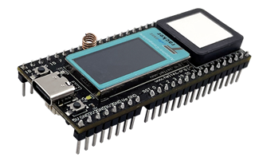
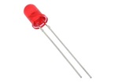
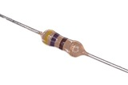
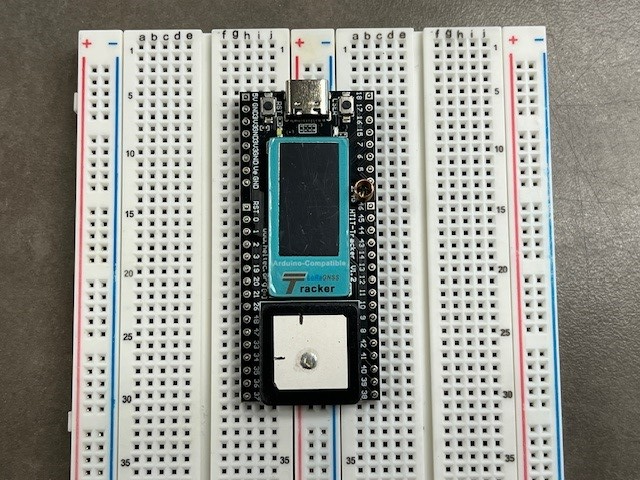
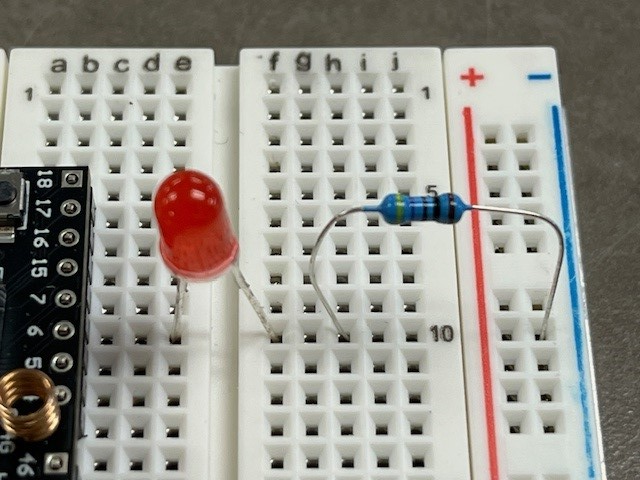
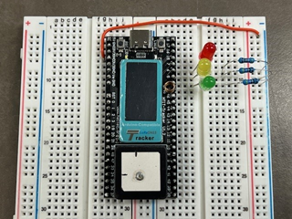

# Lesson 2: Running a Program on the ESP32 Microcontroller

### Prerequisites
- To complete this lesson, you need to be able to connect your microcontroller to your computer and upload a program to it using the IDE. If you are not able to do that, please complete [Lesson 1](../lesson-1/README.md) before continuing.

### Objectives
Students will: 
- Learn the purpose of the initialiation, setup and loop sections of a microcontroller program  
- Write a basic program to make the onboard LED blink 
- Write a more complex program that causes an LED array to act like a stop light

### Materials
- [Heltec Wireless Tracker](https://heltec.org/project/wireless-tracker/)\
  
- [Breadboard](https://learn.sparkfun.com/tutorials/how-to-use-a-breadboard/all)\
 
- [Red, yellow, and green LEDs](https://en.wikipedia.org/wiki/Light-emitting_diode)\

- [470-ohm resistors](https://en.wikipedia.org/wiki/Resistor)\


## Activity

### Blinking the Onboard LED
One of the first things many programmers test on a new microcontroller is whether they can control the outputs of the microcontroller. The easiest way to check this is to turn some lights on and off, starting with the white LED that is soldered to the Wireless Tracker baord.

1. Open the Aruidno IDE on your computer. If there is a previous program in the window, press Ctrl-N to open a new file.

2. Connect your ESP microcontroller:
    - Plug the ESP32 Wireless Tracker board into your computer using a USB-A to USB-C cable. 
    - Go to the **Tools** menu in the top menu bar. Select the **Board** option, then **Heltec ESP32 Series Dev Boards**, then finally **Wireless Tracker**.\
    
    - Again, go to the **Tools** menu in the top menu bar. Select the **Port** option, then select the port that most closely appears to be your ESP32 microcontroller. Often, there will be only one option. If the choices are not clear, ask you mentor or instructor for guidance.


3. Delete the template code that is in the editor window and replace it with the code below.
    ```
    // Declarations
    // put any settings, important variables, and objects here

    void setup() {
      // put your startup code here, to run once on bootup
      // if you want a program to run once and stop, put all of the code here
    }

    void loop() {
      // put any code here that you want to run repeatedly
    }

    void newMethod(){
      // you can write other sections of code, called methods, that you can run from setup() or loop()
    }
    ```
    This code is not much different than the template code, but notice a few important things:
    - There are *four* sections to your code. What are they?
    - Lines that begin with // are comments. They give information to the programmer and are ignored by the computer
    - There is a pattern to how lines are indented. See if you can figure out and follow this pattern.


4. Add some lines to control the built-in LED on the Wireless Tracker board.
    - In the declaration section, add the line below. It tells the program that the on-board LED is connected to pin 18.\
    ``` #define BOARD_LED 18 ```
    - Inside the ```setup()``` section, add the line below. It sets the same pin to be an *output*, where power flows out from the baord to the LED. Later, we will set some pins to be *inputs*.\
    ``` pinMode(BOARD_LED, OUTPUT); ```
    - Inside the ```loop()``` section, and the lines below. You should be able to figure out what they do.
    ```
    digitalWrite(BOARD_LED, HIGH);  
    delay(1000);                     
    digitalWrite(BOARD_LED, LOW);  
    delay(1000);
    ```

5. Upload your program. If successful, you should see a white light turning on and off once per second. If your IDE reports errors, look carefully at your code compared to the lines above. Even a small typo, like forgetting one of the ; characters, will cause an error.

6. Once the LED is blinking correctly, experiment with it. See if you can get it to blink faster, slower, or even in a pattern. 

### Adding More Outputs
Besides the onboard LED, the Wireless Tracker can control 40 other outputs! Most of them are already being used with the GPS, radio, and display, so there are only about 10 that we can use without interference. For now, we will use the ones numbered 4 through 6.

1. Carefully place the Wireless Tracker on your breadboard as shown in the image below. Notice how it straddles the center row so that we can use the sockets on each side to connect to the pins on the Wireless Tracker board.
      <br>
      
  
2. Place components on your breadbaord:
    - Connect green, yellow, and red LEDs to pins 4, 5, and 6. Notice that the LEDs have one wire that is longer. The longer wire should go in the socket that is connected to pin 4, 5, or 6. The shorter wire should go in the next row, past the channel cut into the bredboard.
    - Connect 470-ohm resistors to the row with the short ends of the LEDs and the vertical row that is colored with a blue stripe, on the side of the board. See the image below.
    - Connect a jumper wire from one of the board pins labeled GND to the blue-striped ground row on the breadbaord. This completes the circuit back to the microcontroller from the breadboard.
      <br>
      
      
      
3. Add the following lines to the declaration section:
    ```
    #define RED_LED 6
    #define YEL_LED 5
    #define GRN_LED 4
    ```

4. Add the following lines inside the ```setup()``` section:
    ```
    pinMode(RED_LED, OUTPUT);
    pinMode(YEL_LED, OUTPUT);
    pinMode(GRN_LED, OUTPUT);
    ```

5. Add lines inside the ```loop()``` section that turn all the LEDs on and off along with the white onboard LED. If you need a hint, realize that we are just copying what we did with the white LED for our new red, yellow and green LEDs.

6. Once you get all of the LEDs working, create a stoplight. The stoplight should operate like this:
    - first, the green LED should be on and the other LEDs off for 4 seconds.
    - next, the yellow LED should be on and the others off for 1 second.
    - then, the red LED should be on and the others off for 5 seconds.
    - these steps should repeat continuously.
    - if you wish, have the white LED represent a walk signal for pedestrians. When should this LED be on?

### Bonus: Inputs
As you might have guessed, the microcontroller's pins can be used as inputs as well as outputs. One easy input to experiemnt with is the user pushbutton built in to the Wireless Tracker board. This is the button closest to pin 18. The other button near the 5V pin resets the microcontroller.

1. To use the user pushbutton, you will first configure it like you did for the LEDs:
    - In the declaration section, add the line below because user pushbotton is on pin 0.\
    ``` #define USER_BTN 0 ```
    - Inside the ```setup()``` section, add the line below to set the same pin to be an input.\
    ``` pinMode(USER_BTN, INPUT); ```

2. Write code in the ```loop()``` section to check the value of the pushbutton and respond to it. One simple technique looks like this:
    ```
    if (digitalRead(USER_BTN) == 0){    // on this baord, '1' is not pressed and '0' is pressed
      digitalWrite(BOARD_LED, HIGH);
    } else {
      digitalWrite(BOARD_LED, LOW);
    }
    ```

3. Challenge: Some stop lights have crosswalk buttons where a pedestrian can interupt a green light to stop traffic and cross the street. Can you make the user pushbotton act like the crosswalk button? It would work something like this:
    - normally, the green LED should be on and the other LEDs off.
    - if the user presses the burron, the yellow LED should turn on and the others off for 1 second.Then, the red LED should be on and the others off for 5 seconds. The white LED should turn on with the red LED to show that pedestrians can cross.
    - after these steps, the light should return to green until the user presses the button again.


*Still stuck? With your mentor, take a look at the [solution code linked on Github](../lesson-2/Lesson_2_solution.ino).*