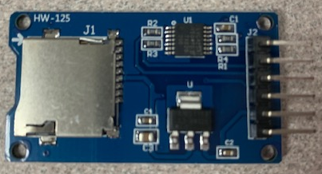
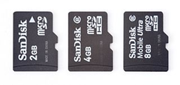

# Lesson 5: How to Write Stuff Down

### Prerequisites
- To complete this lesson, you need to be able to connect your microcontroller to your computer and upload a program to it using the IDE. If you are not able to do that, please complete [Lesson 1](../lesson-1/README.md) before continuing.
- You should have a good understanding of how to write code in the declaration, setup, and loop sections of a program. It is recommended to complete [Lesson 2](../lesson-2/README.md).
- This lesson makes use of the BMP180 sensor that was used in lesson 4. To record sensor data at the end of this lesson, you will need to complete [Lesson 4](../lesson-4/README.md).

### Objectives
Students will: 
- Connect an SD card reader to a microcontroller
- Learn how the SPI protocol is used for peripheral communication
- Record sensor data to SD card

### Materials
- [Heltec Wireless Tracker](https://heltec.org/project/wireless-tracker/)\
  
- [BMP180 Sensor](https://www.adafruit.com/product/1603)\
  
- [Micro SD Card Reader](https://www.adafruit.com/product/254)\
  
- [Micro SD Card](https://en.wikipedia.org/wiki/SD_card)\
  
- Breadboard
- Jumper Wires
  
## Activity

### Understanding the Tech
SD cards are another amazing modern technology that usually gets overlooked. A "Micro SD" card is smaller than a dime but can hold billions and billions of words, numbers, or other data. 

The entire contents of the Normal Public Library could be stored on a single 64 Gb SD card! And in 2025, a micro SD card of this size was available for less than ten dollars. Storing information has never been cheaper or smaller. After this lesson, you can decide whether it is *easy* as well.

### Communicating with the SD Card
SD cards use a different communication protocol than sensors like the BMP180. Instead of I2C, the protocol is called the *Serial Peripheral Interface* or *SPI* (pronounced either as "s-p-i" or "spy"). It uses a few more wires that I2C but can also be much faster, which s handy for writing lots of data to an SD card. Like using I2C, we will make use of existing library code to handle the SPI communication with the SD card. 

1. Open the Arduino IDE and start a new program. 

2. Erase any existing text, then add the following initialization code:
    ```
    #include "FS.h"
    #include "SD.h"
    #include "SPI.h"

    // Define SPI and set pins for communication
    SPIClass spi;
    #define CS    4
    #define MOSI  5
    #define CLK   6
    #define MISO  7

    void setup() {
	  Serial.begin(115200);   // set up the serial protocol to  communicate with laptop
      mountSDCard();
      delay(1000);            // pause to allow all initialization to finish
      appendDataToFile("/test.txt","1,2,3,4");
    }
    ```
    If you try to comple this code now, you will get errors. The Arduino IDE does not know what "mountSDCard" or "appendDataToFile" are. That is because they are not built in to the library code. We will add them, telling the computer some specific instructions for each one.

3. *Mount* is a computer word meaning to connect to a storage device like a hard drive or network file system. In our case, it is the SD card. Add the following code at the very bottom of your program:
    ```
    void mountSDCard(){
        Serial.println("Mounting SD Card....");
        spi.begin(CLK, MISO, MOSI, CS);                     // init SPI with correct pins
        if(!SD.begin(CS, spi)){                             // try to communicate with SD card
            Serial.println("Card mount failed");
        }
        int cardSize = SD.cardSize() / (1024 * 1024 * 1024);// find card size in gigbytes
        Serial.print("Mounted SD card with size of ");
        Serial.print(cardSize);
        Serial.println(" Gb");
    }
    ```
    Notice that most of the code is print statements telling us what is going on. This is helpful for when things don't work correctly. The two lines that actually do the work have the word "begin" in them.

4. Once the SD card is mounted, we can use it just like any other drive. It is possible to create, edit, and delete files and folders on the SD card. For our purposes, we will focus on writing data to a file. We will use the file *append* operation. A file append operation works like this:
    - If the file already exists, our data will be added to the bottom of the data in the file
    - If the file does not exist, it will be created and our data will be put into the file
    
    Add this section of code to the very bottom of your program:
    ```
    void appendDataToFile(const char * filename, const char * data){
        File file = SD.open(filename, FILE_APPEND);       // try to open the file to append (add on) data
        if(!file){                                        // check file access error
            Serial.println("Failed to open file");
        }
        if(file.print(data)){                             // try to actually write the data
            Serial.printf("Data written to %s: %s\n",filename, data);
        } else {                                          // check file writing error
            Serial.println("File write failed");
        }
        file.close();                                     // close file to finish up
    }
    ```
    Again, there are some print statements telling us what is going on, but there is more activity in this code section. See if you can figure out what all of the lines are doing.

5. Click the checkmark button in the Arduino IDE. It may take a while for your code to compile, so continue on to the next section while it is compiling.

### Wiring the SD Card Reader
The SD card reader needs six wires connecting it to the circuit: 3.3V power, ground, CLK, CS, MOSI, and MISO. The purpose of the last four are:
    - CLK is the clock signal to set the timing for how fast bits should be sent
    - CS is the *chip select* signal that turns on the output of the card reader
    - MOSI carries data from the microcontroller to the card reader
    - MISO carries data from the card reader to the microconroller
Notice that SPI has a separate line for data going in each direction, unlike I2C which can only carry data in one direction at a time. This is one reason why SPI is faster than I2C. 

1. **Unlplug the microcontroller from power and USB.** Do not remove the BMP180 sensor or its wiring. Place the SD card reader onto the breadboard slightly above the microcontroller. Place it so that the six pins are in six different rows of the breadbaord.

2. Connect a jumper wire from the SD card reader 3.3V pin to the red "power" rail of the breadboard. Also connect the same red power rail to the 3.3V pin on the microcontroller if you have not done so in a previous lesson.

3. Connect a jumper wire from the SD card reader GND pin to the blue "ground" rail of the breadboard. Also connect the same blue ground rail to the GND pin on the microcontroller if you have not done so in a previous lesson.

4. The CLK, CS, MOSI, and MISO pins of the card reader connect to pins 4 though 7 of your microcontroller. Look at your code in the Arduino IDE to figure out which pin to connect to which number. The photo below shows one way of neatly connecting these wires. It is okay to use longer wires with some slack, but try to keep your board neat.

5. Plug the microcontroller into your laptop and upload the code using the right arrow button. After the code has run, unplug the microcontroller, remove the SD card, and insert the SD card into your laptop. Check to see that the file was written correctly.

### Writing Real Data
To complete this lesson, we will add code to repeatedly write data from the BMP180 sensor to the SD card. You will take lines from your working program from Lesson 4 and insert those lines into your SD card program in this lesson.

1. You will need to add all of these lines from Lesson 4 to the initialization section of your program. Arrange the code so that all of the ```#include``` lines are together, then keep the other groups together.
    ```
    #include <Arduino.h>
    #include <Wire.h>
    #include <BMP180.h>

    BMP085 bmp;               // create a sensor object (085 is not a typo)
    #define SDA 46            // ...and set its I2C pin connections
    #define SCL 45
    ```
2. Also add these lines in the ```setup()``` section:
    ```
   	Wire.begin(SDA, SCL);   // set up the I2C protocol to communicate with sensors
    bmp.begin();            // start communicating with the BMP180 sensor
    ```

3. Move the line ```writeDataToFile("/test3.txt","1,2,3,4");``` to the ```loop()``` section and add a delay of about 3 seconds, like this:
    ```
    void loop() {
        writeDataToFile("/test.txt","1,2,3,4");
        delay(3000);
    }
    ```

4. The code so far will write "1,2,3,4" to the file every 3 seconds. Instead, we would like to write something useful from the BMP180 sensor, like the temperature. The line that reads the temperature from the BMP 180 is: ```double tempC =bmp.readTemperature();``` Add this line to the top of the loop section. Then add these lines that create a neatly formatted output string:
    ```
    void loop() {
        double tempC =bmp.readTemperature();
        char data[10];                        // create a character array to hold output
        dtostrf(tempC, 0, 2, data);           // convert the temp int characters
        writeDataToFile("/test.txt",data);    // write the data characters to file 
        delay(3000);
    }
    ```

5. Upload and test your code. 