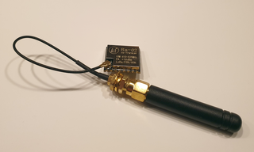

# Lesson 7: LoRa

### Prerequisites
- To complete this lesson, you need to be able to connect your microcontroller to your computer and upload a program to it using the IDE. If you are not able to do that, please complete [Lesson 1](../lesson-1/README.md) before continuing.

### Objectives
Students will: 
- Transmit and receive radio signals using LoRa technology
- Use an antenna to improve signal quality
- Monitor the performance of a radio link and discover how obstacles, noise, and distance affect the link

### Materials
- [Heltec Wireless Tracker](https://heltec.org/project/wireless-tracker/)\
  
- [915 MHz Quarter-Wave Antenna]\
  

## Activity

### Understanding the Tech
Like many of the technologies that we're covering, we use radio waves all the time. Celll phone calls, SMS (texts), WiFi, Bluetooth, AM, FM, Satellite XM, and many other forms of communciation are all based on radio waves that carry data through the air. Radio wves are *electromagnetic* waves that don't need air or wires to travel. They can even move easily through the vacuum of space.

Radio communication is a huge and amazing topic. In this lesson, we will focus on using just one type: LoRa, which stands for LOng RAnge radio communication. LoRa was developed in 2014, which is quite new for a radio technology. 

LoRa has some big advantages over older radio technologies:
* very low power usage
* range of up to 200 miles even at low power
* small circuit boards and antennas
* high tolerance for noisy signals
* no license needed

...and a few disadvantages:
* low data rates - 30 to 3000 bytes/second with the highest rates having the shortest range
* interference from other users as popularity grows
* legal limts on how much data can be transmitted

### Setting Up and Testing the Hardware
Any radio communication requires two devices - a transmitter and a receiver. This lesson works best if your instructor has alrady uploaded the transmitter code onto one device and uploaded the receiver code onto a device for each group. If not, you will need to upload code to a transmitter and a receiver.

1. Check that the transmitter is powered on. Read the status messages displayed on its LCD to see what it is doing.

2. Power on your receiver and read its status messages. If a data packet is recevied, the LCD will show the data and some stats about the quality of the radio signal. If you do not receive any packets, try getting closer to the transmitter. If you still don't receive anything, don't worrk and go on to step 3.

3. Power off your recevier, then have your mentor or instructor help you attach an antenna to your receiver. **Be careful and take your time.** The antenna connection is very fragile.

4. Again power on your receiver and look for incoming data packets. When you get one, write down the RSSI and SNR values. (The frequency error is less important as long as it is smaller than about 25000 Hz.) Split up your group to look up what these terms mean and what is an acceptable range for each one in LoRa radio.

5. Experiment with what makes your signal better or worse. Try things like:
* moving closer to or farther from the transmitter
* putting objects or walls in the radio path
* pointing the antenna in different directions
* using a different antenna type (if available)
For each experiment, record the RSSI and SNR. What situation makes the worst signal that is still receivable?

6. Challenge: For a high-altitude ballon launch, we will need a signal range of at least 30 miles. Each time the distance is doubled, the RSSI decreased by 6 dBm. Can you figure out whether or not we have enough range?

## Programming
Unlike previous lessons, this lesson will not walk through the code step-by-step. Instead, consider it your challenge to figure out the key lines in the code below. Notice that many of the lines have to do with displaying information on the screen. To figure out the radio code, look for the lines with the term ```lora.``` in them.

If you compile this code yourself, you will need to install the RadioLab library by Jan Gromes into the Arduino IDE.

### Receiver Code
```
/*
* LoRa receiver code
*/

#include "HT_st7735.h"
#include <RadioLib.h>

#define LORA_NSS  8             // these 4 pin numbers are specific to the Heltec Wireless Tracker
#define LORA_DIO1 14
#define LORA_NRST 12
#define LORA_BUSY 13
#define LORA_MHZ 915.0          // fixed by FCC rules
#define LORA_BANDWIDTH 125.0    // fixed in LoRa spec
#define LORA_SF 12              // SF7 - SF12 are options
#define LORA_CODERATE 7         // 5 - 8 are options
#define LORA_SYNCWORD RADIOLIB_SX126X_SYNC_WORD_PRIVATE
#define LORA_POWER 20
#define LORA_PREAMBLE 8
#define LORA_REF_V 1.6
#define LORA_LDO_REG false

HT_st7735 screen;

// initalize lora radio and make an interrupt function for when packets arrive
SX1262 lora = new Module(LORA_NSS, LORA_DIO1, LORA_NRST, LORA_BUSY);
volatile bool packetAvailable = false;
ICACHE_RAM_ATTR             // puts onReceive in RAM for better memory access
void onReceive(void) {
  packetAvailable = true;
}

void setup() {
  Serial.begin(115000);
  screen.st7735_init();
  screen.st7735_fill_screen(ST7735_BLACK);
  loraInit();
}

void loop() { 
  if(packetAvailable){
    readPacket();
  } 
}
  
int loraInit(){
  screen.st7735_write_str(0, 0, "LORA init...", Font_7x10, ST7735_WHITE, ST7735_BLACK);
  int status1 = lora.begin(LORA_MHZ, LORA_BANDWIDTH, LORA_SF, LORA_CODERATE, LORA_SYNCWORD, LORA_POWER, LORA_PREAMBLE, LORA_REF_V, LORA_LDO_REG);                    
  lora.setPacketReceivedAction(onReceive);      // tells lora to call the interrupt function when a packet arrives
  int status2 = lora.startReceive();

  if (status1 == RADIOLIB_ERR_NONE && status2 == RADIOLIB_ERR_NONE) {
    screen.st7735_write_str(90, 0, "OK", Font_7x10, ST7735_GREEN, ST7735_BLACK);
  } else {
    screen.st7735_write_str(90, 0, "ERR", Font_7x10, ST7735_RED, ST7735_BLACK);
    screen.st7735_write_str(120, 0,  (String)status1, Font_7x10, ST7735_WHITE, ST7735_BLACK);
    screen.st7735_write_str(140, 0,  (String)status2, Font_7x10, ST7735_WHITE, ST7735_BLACK);
  }
  return status1 + status2;                       // can be used for status checking: will be 0 if no errors
}

void readPacket() {
    String data;
    int status = lora.readData(data);             // data is stored into "data" and status is stored is "status"
    if (status == RADIOLIB_ERR_NONE) {
        screen.st7735_write_str(0, 12, "Data: ", Font_7x10, ST7735_WHITE, ST7735_BLACK);
        screen.st7735_write_str(64, 12, data, Font_7x10, ST7735_WHITE, ST7735_BLACK);

        String rssi = (String)lora.getRSSI();
        screen.st7735_write_str(0, 24, "RSSI:          dBm", Font_7x10, ST7735_WHITE, ST7735_BLACK);
        screen.st7735_write_str(64, 24, rssi, Font_7x10, ST7735_WHITE, ST7735_BLACK);

        String snr = (String)lora.getSNR();
        screen.st7735_write_str(0, 36, "SNR:           dB", Font_7x10, ST7735_WHITE, ST7735_BLACK);
        screen.st7735_write_str(64, 36, snr, Font_7x10, ST7735_WHITE, ST7735_BLACK);

        String freqErr = (String)lora.getFrequencyError();
        screen.st7735_write_str(0, 48, "Freq Err:       Hz", Font_7x10, ST7735_WHITE, ST7735_BLACK);
        screen.st7735_write_str(64, 48, freqErr, Font_7x10, ST7735_WHITE, ST7735_BLACK);

    } else if (status == RADIOLIB_ERR_CRC_MISMATCH) {
        screen.st7735_write_str(0, 12, "CRC Error", Font_7x10, ST7735_RED, ST7735_BLACK);
        screen.st7735_write_str(0, 24, "Malformed Packet", Font_7x10, ST7735_WHITE, ST7735_BLACK);
    } else {
        String err = (String)status;
        screen.st7735_write_str(0, 12, "Rx Error:", Font_7x10, ST7735_RED, ST7735_BLACK);
        screen.st7735_write_str(80, 12, err, Font_7x10, ST7735_WHITE, ST7735_BLACK);
    }
    packetAvailable = false;   // reset flag
}
```

### Transmitter Code
```
/*
* LoRa transmitter code
*/

#include "HT_st7735.h"
#include <RadioLib.h>

#define LORA_NSS  8             // these 4 pin numbers are specific to the Heltec Wireless Tracker
#define LORA_DIO1 14
#define LORA_NRST 12
#define LORA_BUSY 13
#define LORA_MHZ 915.0          // fixed by FCC rules
#define LORA_BANDWIDTH 125.0     // fixed in LoRa spec
#define LORA_SF 12   // SF7 - SF12 are options
#define LORA_CODERATE 7
#define LORA_SYNCWORD RADIOLIB_SX126X_SYNC_WORD_PRIVATE
#define LORA_POWER 20
#define LORA_PREAMBLE 8
#define LORA_REF_V 1.6
#define LORA_LDO_REG false

HT_st7735 screen;

// initalize lora radio and make an interrupt function for when packets finish sending
SX1262 lora = new Module(LORA_NSS, LORA_DIO1, LORA_NRST, LORA_BUSY);
volatile bool txBusy = false;
ICACHE_RAM_ATTR             // puts onReceive in RAM for better memory access
void onTxDone(void) {
  txBusy = false;
}
int transmissionStatus = RADIOLIB_ERR_NONE;   // initial status is no errors
int packetCount = 0;

void setup() {
  Serial.begin(115000);
  screen.st7735_init();
  screen.st7735_fill_screen(ST7735_BLACK);
  loraInit();
}

void loop() {
  if(!txBusy){
    sendPacket();
  }
  delay(1000);
}

int loraInit(){
  screen.st7735_write_str(0, 0, "LORA init...", Font_7x10, ST7735_WHITE, ST7735_BLACK);

  int status = lora.begin(LORA_MHZ, LORA_BANDWIDTH, LORA_SF, LORA_CODERATE, LORA_SYNCWORD, LORA_POWER, LORA_PREAMBLE, LORA_REF_V, LORA_LDO_REG);                    
  if (status == RADIOLIB_ERR_NONE) {
    screen.st7735_write_str(90, 0, "OK", Font_7x10, ST7735_GREEN, ST7735_BLACK);
  } else {
    screen.st7735_write_str(90, 0, "ERR", Font_7x10, ST7735_RED, ST7735_BLACK);
    screen.st7735_write_str(100, 0,  (String)status, Font_7x10, ST7735_RED, ST7735_BLACK);
  }
  lora.setPacketSentAction(onTxDone);
  delay(2000);
  return status;
}

void sendPacket(){
  txBusy = true;
  String str = "Packet# " + String(packetCount);
  packetCount++;

  screen.st7735_write_str(0, 10, "Sending: ", Font_7x10, ST7735_WHITE, ST7735_BLACK);
  screen.st7735_write_str(56, 10, str, Font_7x10, ST7735_WHITE, ST7735_BLACK);
  transmissionStatus = lora.startTransmit(str);
  while(txBusy);          // wait for tx completion
  lora.finishTransmit();

  if (transmissionStatus == RADIOLIB_ERR_NONE) {
    String msg = "OK";
    screen.st7735_write_str(140, 10, msg, Font_7x10, ST7735_GREEN, ST7735_BLACK);      
  } else {
    String msg = "ERR "+transmissionStatus;
    screen.st7735_write_str(140, 10, msg, Font_7x10, ST7735_RED, ST7735_BLACK);      
  }
}
```

## More Advanced Topics
There are many settings that can be confgiured on a LoRa radio to increase bitrate, range, or reliability. Each change comes with tradeoffs. For example, increasing bitrate decreases range. [This article](https://medium.com/@prajzler/what-is-lora-the-fundamentals-79a5bb3e6dec) goes into detail on how LoRa works and how to adjust settings. The specific commands used in our code are explained [here](https://github.com/jgromes/RadioLib/wiki/Default-configuration#sx126x---lora-modem). Note that the US used 915 MHz as the transmission frequency, not 434 MHz.